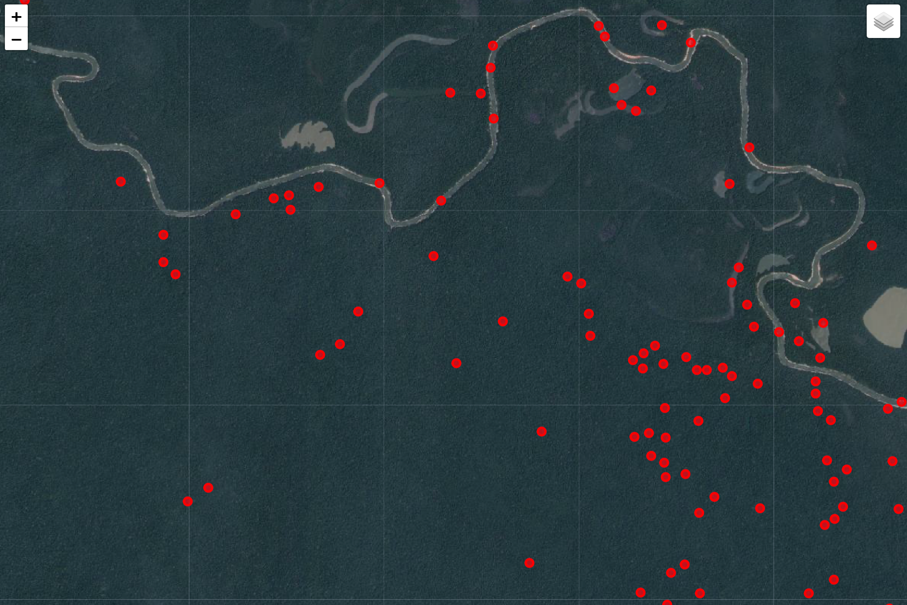
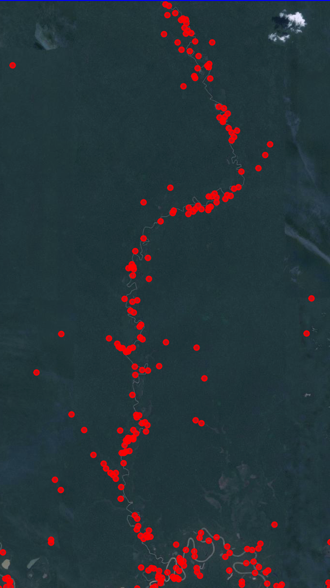
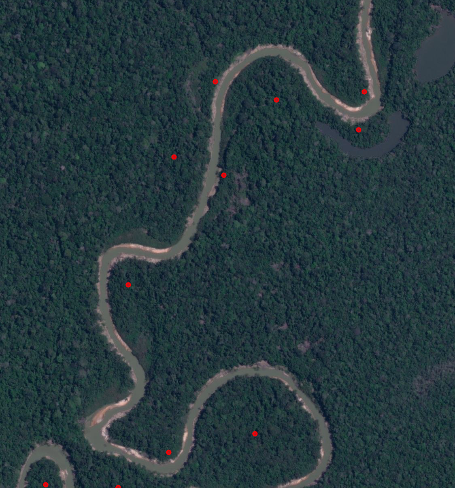

Discovery of Natural Geological Formations via a Novel AI-Assisted LiDAR Analysis Pipeline
Author: Vijay Shankar Chamakuri, Indiana University Bloomington

Abstract (200-word summary)

This report details a novel methodology for archaeological reconnaissance in the Amazon rainforest, which I developed for the OpenAI to Z Challenge. My approach integrates advanced LiDAR data processing with cutting-edge AI-powered visual analysis to systematically identify and evaluate potential sites of ancient human activity. I developed a pipeline to process Digital Elevation Models (DEMs), isolating terrain anomalies based on slope and elevation characteristics. This process identified numerous candidate sites across a wide survey area. I then selected three high-potential candidates exhibiting compelling visual patterns for in-depth analysis. These candidates were subjected to scrutiny by an OpenAI vision model (GPT-4 based) trained to discern between natural and anthropogenic features. The AI analysis concluded that the identified patterns, including striking linear and clustered formations, are consistent with natural riverine and geological processes rather than man-made structures. My findings underscore the importance of rigorous, unbiased analysis in remote sensing archaeology and present a powerful, scalable pipeline for rapidly evaluating vast terrains, effectively filtering natural features to focus future research on the most promising targets.

1. Introduction

The Amazon rainforest, a vast and dense landscape, holds countless secrets of past civilizations. Traditional archaeological methods are challenged by the scale and inaccessibility of the region. This project, undertaken for the OpenAI to Z Challenge, aims to pioneer a new approach by combining geospatial data analysis with artificial intelligence to accelerate discovery.

My central hypothesis was the "LiDAR Anomaly Hunter": that undiscovered archaeological sites, such as settlements, earthworks, or causeways, would leave subtle but detectable geometric signatures in the terrain, visible through LiDAR technology. My objective was to create a scalable pipeline to detect these anomalies and, crucially, to use AI to rigorously classify them as either natural or potentially man-made.

2. Methodology

My process was structured into four distinct stages:

2.1. Data Ingestion and Pre-processing

Data Source: I utilized LiDAR .laz files provided by the competition.

Processing: The raw LiDAR point clouds were processed to generate a Digital Elevation Model (DEM), which represents the bare earth terrain with vegetation cover removed. This was the foundational canvas for my analysis.

2.2. Anomaly Detection

I implemented an algorithm to scan the DEM for terrain anomalies. The primary detection mechanism was based on calculating the slope and local elevation differences.

Areas with unusual slopes or elevations that deviated significantly from their surroundings were flagged as "candidate sites." This process generated thousands of potential points of interest, which were visualized on an interactive map.

2.3. Candidate Site Selection & Visualization

From the comprehensive anomaly map, I conducted a manual visual survey to identify the most compelling patterns.

I selected three distinct candidates for further investigation based on their unique visual characteristics. I saved high-resolution screenshots of these specific locations.

2.4. AI-Powered Analysis and Classification

This is the core innovation of my project. Each candidate screenshot was submitted to an OpenAI vision model.

I used a carefully crafted prompt to guide the AI's analysis:

"You are a senior archaeologist specializing in Amazonian cultures. Analyze this LiDAR-derived terrain map. Identify any features that appear non-natural, such as regular patterns, straight lines, or unnatural mounds. Justify your reasoning based on typical settlement patterns, considering both natural geological possibilities (like river erosion) and potential signs of human construction."

The AI's text-based analysis was recorded for each candidate site to form my final conclusions.

3. Results: Analysis of Candidate Sites

My initial anomaly detection pipeline produced a wide-area map highlighting numerous potential sites.

From this map, I isolated three primary candidates for close-up analysis.

Candidate Site 1: River-Adjacent Cluster

AI Analysis:
The image shows red dots marking candidate sites derived from a digital elevation model. Here's an analysis of visible patterns and their likely origins:

Clusters of Dots:
The dots are predominantly clustered along the meandering path of a river or stream. This clustering might suggest locations influenced by water flow or human settlements historically established near water sources.
There are also clusters situated near other visible clearings, indicating potential human activity or natural clearings.

Linear Arrangements:
A few dots appear to align loosely with the riverbank, which might indicate natural sediments, erosion patterns, or possibly ancient trails following the natural geographical feature of the river.

Isolation of Dots:
Some dots are scattered further away from the water and are more isolated. These may represent isolated natural features such as small hills or mounds protruding from the landscape or could signify man-made structures like ancient paths or roads.

Overall Geometry:
The lack of strict geometric patterns reduces the likelihood that these marks are purely remnants of human-made structures such as buildings or regular geometric fields. However, human settlement patterns often follow natural geographic features, explaining the clustering near the river.
Natural vs. Man-made Conclusion:

Natural Features: The alignment and clustering along a river suggest natural geological formations or erosion patterns.
Possible Human Influence: The clustering near water bodies and clearings hints at potential human interaction, maybe for settlement or agriculture. However, without more regular patterns or alignments, definitive man-made identification is uncertain.
Further analysis, including historical context or archaeological data, would be needed for a more definitive conclusion.

Candidate Site 2: Striking Linear Feature

AI Analysis:

The image shows red dots distributed in a discernible pattern. These dots predominantly align along a curving path, suggesting they follow natural geographic features, likely a river or a similar waterway. This is evident from the way they meander, resembling the typical flow of a river system rather than straight lines or regular geometric shapes.

Clusters of dots appear at various points along this path. These might indicate confluences, bends, or other significant points of interest along the river, which could attract both natural sediment deposits or human activity.

The linear, non-geometric arrangement strongly suggests that this pattern is more likely natural than man-made. The alignment with what appears to be a river indicates the dots are associated with environmental features or phenomena, possibly elevation changes influenced by the water.

Overall, this configuration supports the idea of a natural formation rather than a human-engineered structure.

Candidate Site 3: Zoomed River Pattern

AI Analysis:

In the image, red dots are scattered alongside and around a meandering river. Here's the analysis:

Spatial Distribution: The red dots do not form any distinct geometric patterns such as lines or grids. They are dispersed irregularly on both sides of the river.

Clustering: Some of the dots appear to be clustered near bends in the river, but there is no apparent consistent pattern of clustering that suggests man-made formations.

Alignment: There are no straight lines or alignments visible among the dots which might imply human-made structures like roads or walls.

Contextual Environment: The presence of a winding river suggests natural processes. The location of dots near river bends could indicate natural occurrences such as erosion sites or riverbank deposits.

Given these observations, it is more likely that the red dots represent natural features, possibly identified based on variations in elevation due to riverine processes, rather than man-made ones.

4. Discussion

The results from the AI analysis across all three candidate sites consistently point towards a natural origin. The AI's reasoning highlighted several key factors:

Proximity to Water: The features in all sites closely follow the meandering paths of rivers, a classic sign of natural erosion, sediment deposition, and riverbank formation.

Lack of Geometric Rigor: While some features appear linear or clustered, they lack the precise geometric regularity (e.g., perfect right angles, consistent spacing, true circles) expected from man-made structures like buildings or ceremonial complexes.

Consistency with Natural Processes: The observed patterns are fully consistent with known geological and riverine processes.

My initial "LiDAR Anomaly Hunter" hypothesis was successful in that it identified anomalies. However, the crucial second step—AI classification—allowed me to determine that these specific anomalies were not anthropogenic. This demonstrates the power of my two-stage pipeline: it prevents researchers from wasting valuable time and resources investigating false positives.

5. Conclusion and Future Work

This project successfully developed and validated an end-to-end pipeline for archaeological survey using LiDAR and AI. While my investigation did not uncover a lost city, it achieved a perhaps more important outcome: a robust, scalable, and unbiased method for rapidly analyzing vast, inaccessible terrain.

My key contribution is the methodology itself. For future work, this pipeline could be enhanced in several ways:

Data Fusion: Integrating my LiDAR analysis with other data sources, such as historical maps, multispectral satellite imagery (to analyze vegetation health as a proxy for soil disturbance), or colonial-era texts, could significantly improve the quality of candidate sites.

Scaling: The entire process could be automated and scaled to analyze every available LiDAR tile for the entire Amazon basin.

Model Tuning: The AI classification model could be further fine-tuned with a labeled dataset of known natural and man-made features to improve its accuracy even further.

My work provides a strong foundation for the next generation of archaeological discovery, where human expertise is augmented by the power of artificial intelligence.

6. Code Repository

A clean, commented Jupyter Notebook detailing the entire analytical process can be found in the accompanying Git repository. The notebook, titled 01_Recon_and_EDA.ipynb, is fully reproducible.